

# Free Mail

**A modern mail app for your Free (`@free.fr`) mailbox.**
Read, write and tidy up your mail in a clean, fast app with real notifications.

&nbsp;

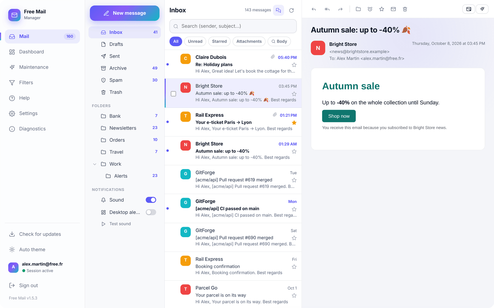

---

## What it does

<table>
<tr>
<td align="center" width="25%">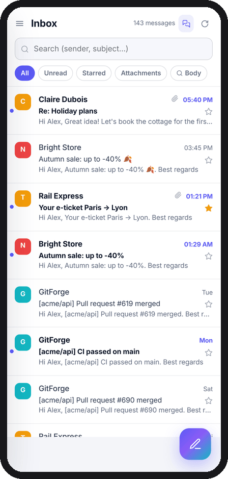 <b>Your inbox</b> Search, filters (unread, starred, attachments), swipe to archive or delete.</td>
<td align="center" width="25%">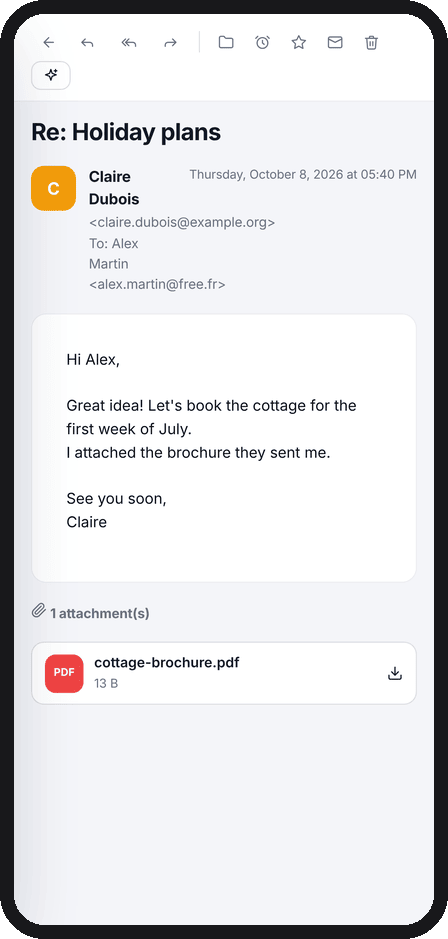 <b>Read</b> Clean display, attachments, remote images blocked until you allow them.</td>
<td align="center" width="25%">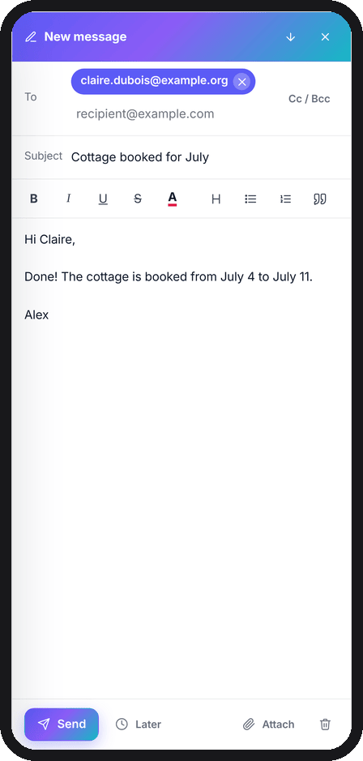 <b>Write</b> Rich text, attachments, signature, send later, undo send.</td>
<td align="center" width="25%">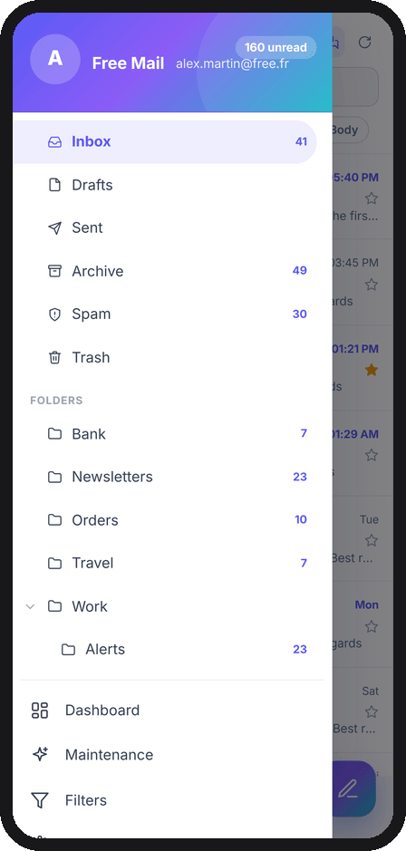 <b>All your folders</b> Unread counters for every folder and sub-folder.</td>
</tr>
<tr>
<td align="center">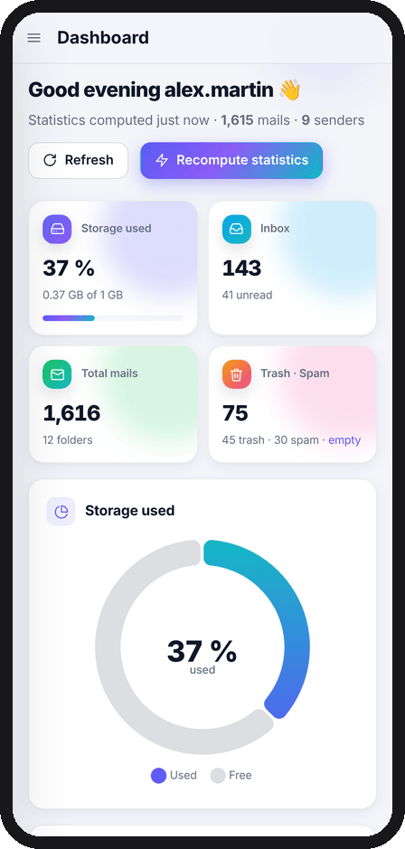 <b>Dashboard</b> Storage used, biggest folders, who fills your inbox.</td>
<td align="center">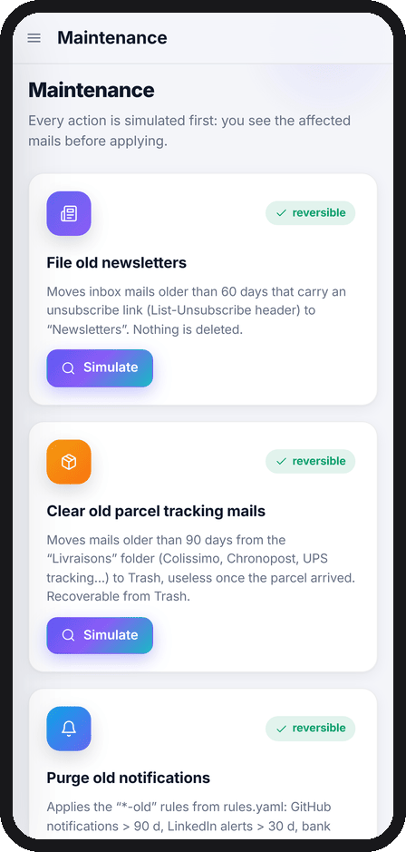 <b>One-tap cleanup</b> Old newsletters, parcel tracking, notifications. Always previewed first.</td>
<td align="center">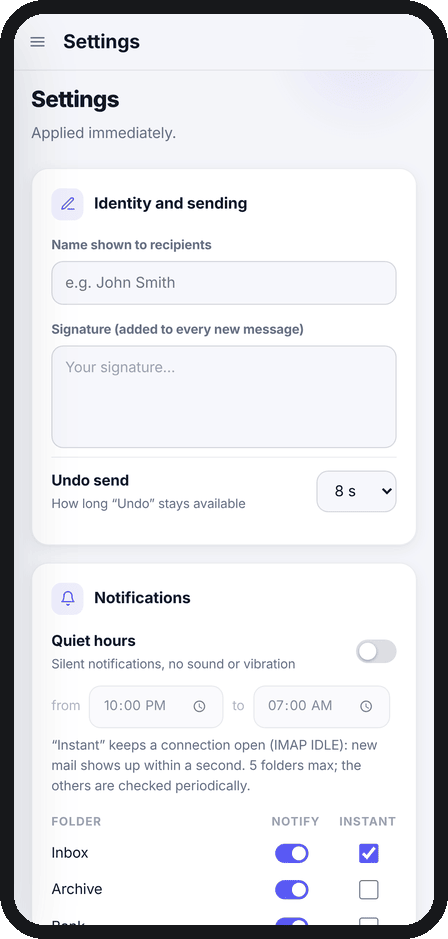 <b>Your settings</b> Signature, quiet hours, per-folder notifications.</td>
<td align="center">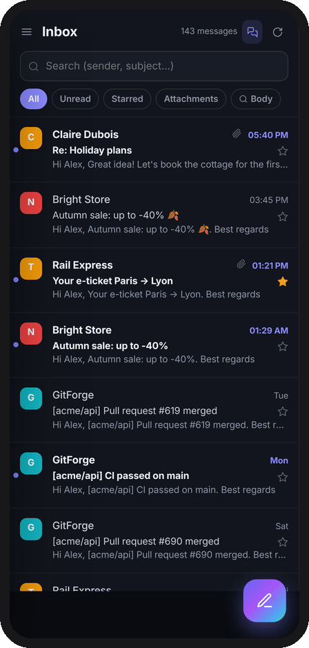 <b>Dark theme</b> Follows your phone, or choose it yourself.</td>
</tr>
</table>

**Also included:** new-mail notifications with *Mark as read* and *Reply* buttons · snooze a mail until later · one-click unsubscribe · conversations view · fingerprint / face lock · English and French · works offline with the last mails you read.

**Private by design:** the app talks directly to Free's servers. Your password is stored encrypted on your phone and never sent anywhere else. No account, no ads, no tracking.

---

## Install on Android

> Requires **Android 10 or newer** and a **Free mailbox** (`…@free.fr`).
> The app is not on the Play Store: you install it from this page, like any downloaded app.

<table>
<tr>
<td width="70%" valign="top">

**1. Download the app**

On your phone, open the **[latest release](https://github.com/jabassou/free-mail/releases/latest)** (or scan the QR code). Scroll down to **Assets** and tap **`FreeMail-vX.Y.Z.apk`**.

**2. Open the downloaded file**

When the download finishes, tap **Open** (or find the file in *Files → Downloads*).

**3. Allow the installation**

The first time, Android asks to allow apps from this source: tap **Settings**, turn on **Allow from this source**, then go back.
If *Play Protect* shows a warning about an unknown app, tap **More details → Install anyway**.

**4. Install**

Tap **Install**, then **Open**.

</td>
<td width="30%" align="center" valign="top">

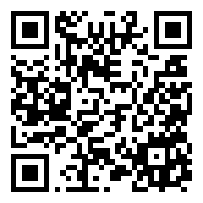 
Scan to open the download page

</td>
</tr>
</table>

### First launch

1. Enter your **Free email address** and its **password**. The app checks them with Free and stores them encrypted on your phone.
2. Allow **notifications**, so you know when new mail arrives.
3. Allow **unrestricted battery** use when asked. Without it, Android may put the app to sleep and notifications arrive late.

That's it: your inbox appears.

---

## Updates

The app checks for new versions by itself (when it starts, then every 30 minutes). When one is out, you get a notification and this window:

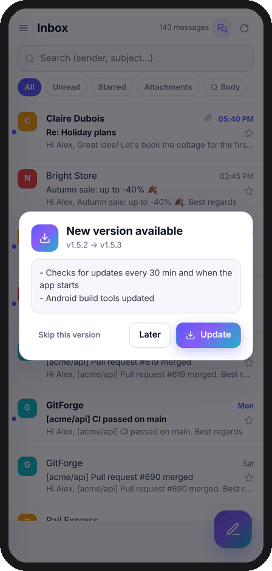

Tap **Update**, then **Install**. Your mail, settings and password are kept.
You can also check at any time: menu → **Check for updates**.

---

## Questions

<b>Is it safe to install an app from outside the Play Store?</b>

Every release is built automatically from the public source code on this page and signed with the same key. Android refuses an update signed with another key, so nobody can slip a modified version in place of this one.

<b>Notifications arrive late or not at all</b>

Check that notifications are allowed and that battery use is set to **Unrestricted** (Android settings → Apps → Free Mail → Battery). The app's **Diagnostics** screen (menu) shows both.

<b>Something does not work</b>

Open menu → **Diagnostics** → **Copy**, then [open an issue](https://github.com/jabassou/free-mail/issues/new) and paste it. It never contains your password, but it can mention mail subjects or addresses: remove anything private before posting.

<b>Does it work on a computer?</b>

Yes, the same interface runs on a computer (macOS or Linux) with Python. See the [technical guide](docs/TECHNICAL.md).

---

Free Mail is an independent project, not affiliated with Free / Iliad. · [Technical guide](docs/TECHNICAL.md) · [Security](SECURITY.md) · [MIT License](LICENSE)
