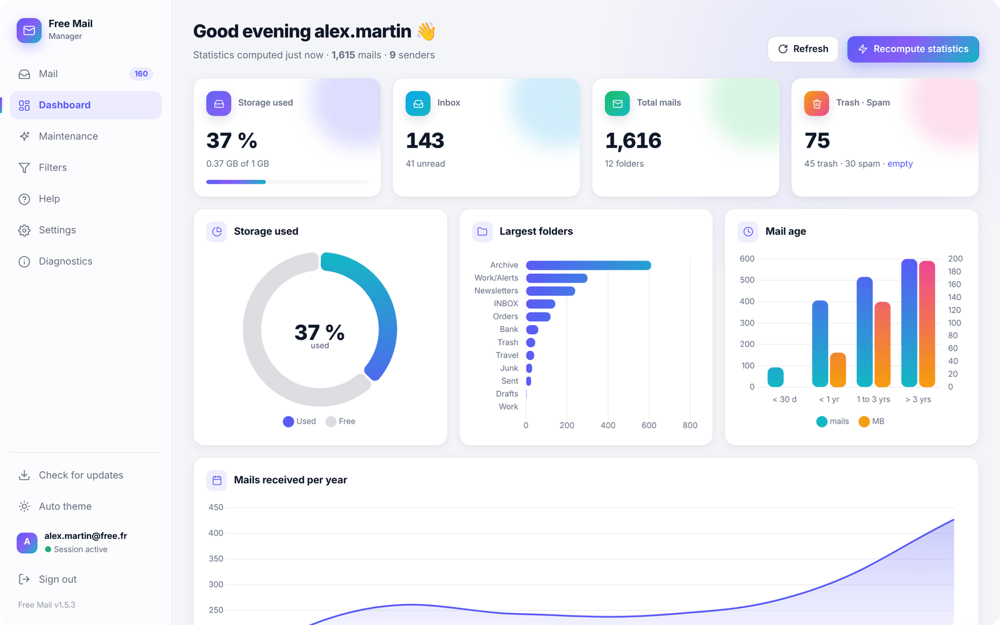

# Free Mail — technical guide

Everything that is not needed to simply install and use the Android app: command-line tool, desktop web UI, Termux mode, building the APK, internals, tests, CI and releases.
For the user guide, see the [README](../README.md).

- [Overview](#overview)
- [Command-line tool](#command-line-tool)
- [Desktop web UI](#desktop-web-ui)
- [Webmail features](#webmail-features)
- [Settings and mail features](#settings-and-mail-features)
- [Android app (APK)](#android-app-apk)
- [Android with Termux (legacy)](#android-with-termux-legacy)
- [Tests](#tests)
- [CI, security and releases](#ci-security-and-releases)

## Overview

| Component | What it is |
|---|---|
| `freemail.py` | CLI: audit, cleanup rules, Zimbra server filters, webmail login |
| `webui.py` | Local HTTP server (stdlib, `127.0.0.1` only, per-run token) serving the UI and the JSON API |
| `mailweb.py` | Mail client backend: IMAP (`imap.free.fr:993`) and SMTP (`smtp.free.fr:465`) |
| `extras.py` | Settings, outbox (undo send / send later), snooze, contacts, quick reply, diagnostics log, update check |
| `web/` | Single-page UI (`index.html`), service worker, icons, vendored Chart.js |
| `android/` | Native app (Kotlin + Chaquopy): runs the same Python backend and shows the UI in a WebView |
| `termux/` | Scripts to run the backend on a phone with Termux |

- IMAP/SMTP verify TLS certificates (`FREEMAIL_INSECURE_TLS=1` only for local tests).
- Server filters use Free's Zimbra SOAP/JSON API (`https://zimbra.free.fr/service/soap`). Free does not document it, so run `filters test` first.

## Command-line tool

The password is stored in the macOS Keychain (`keyring`, service `freemail`), never on disk.
Lookup order: `FREEMAIL_PASSWORD` env var > keyring > `$FREEMAIL_PASSWORD_FILE` or `~/.config/freemail/password`.

### Setup

```bash
python3 -m venv .venv && source .venv/bin/activate
pip install -r requirements.txt
cp config.example.yaml config.yaml   # set user
./freemail.py auth                    # prompts password -> Keychain, tests IMAP login
./freemail.py folders
```

Config overrides: `smtp_host`, `smtp_port`, `webmail_user`, `login_method: auto|http|browser` in `config.yaml`.

### Workflow

```bash
# 1. Read-only audit
./freemail.py report                  # -> out/report-<ts>/summary.md, senders.csv, domains.csv, biggest.csv, stats.json, rules.suggested.yaml
./freemail.py report --since 365 --folder INBOX

# 2. Cleanup (dry-run by default)
cp rules.example.yaml rules.yaml      # or start from out/report-*/rules.suggested.yaml
./freemail.py clean                   # shows counts + samples per rule
./freemail.py clean --only newsletters-old --apply   # confirm prompt, CSV log in out/

# 3. Server-side filters
./freemail.py filters test            # validates SOAP auth on Free
./freemail.py filters pull            # backup current filters -> backups/*.json
cp filters.example.yaml filters.yaml
./freemail.py filters plan            # diff: + add, ~ update, = same, keep, - delete (with --replace)
./freemail.py filters push --apply    # auto-backup before write
./freemail.py filters restore -f backups/filters-before-push-<ts>.json
```

### Safety

- `clean` never expunges outside moved messages: `trash` moves to the Trash folder.
- Each `--apply` writes a CSV log (rule, folder, uid, from, subject, action).
- `filters push` keeps server filters not declared in YAML unless `--replace`.
- Server-side IMAP criteria (from/subject/...) are ASCII-only; use `subject_regex` / `from_regex` for accents.
- If `filters test` fails (auth refused / non-JSON), Free blocks the SOAP API for this account: manage filters in the webmail instead (Preferences > Filters).
- Zimbra folder paths in filters: create one filter in the webmail, run `filters pull` and mirror the `folderPath` format if `fileinto` misbehaves.

### Automatic webmail login

`webmail_login()` opens a Free webmail session the way a browser does, then reuses its cookies for the Zimbra SOAP API:

1. plain HTTP: fetch the login page, fill the form (hidden fields kept), submit, collect `ZM_AUTH_TOKEN`;
2. fallback: headless browser via Playwright (installed Google Chrome, else Playwright Chromium) for JS-built pages.

The password is the Keychain one unless typed in the UI. It tries `user`, then its local part (or `webmail_user`).

```bash
pip install playwright            # optional, only for the browser fallback
./freemail.py login               # test; --method browser --show to watch the browser
./freemail.py filters test        # filters commands now log in by themselves
```

In automatic mode an expired session is reopened transparently. The manual cookie method stays available as a fallback (captcha, 2FA, page changes): paste the full `Cookie` header of a webmail `SearchRequest` (DevTools > Network > filter `soap`).

## Desktop web UI

```bash
source .venv/bin/activate
./webui.py                 # opens http://127.0.0.1:8765/?t=<random token>
```



- Bound to 127.0.0.1 only, random per-run token (`X-Token` header), Host header check. The Zimbra cookie lives in memory only.
- **Dashboard**: live folder counters + quota, charts from the latest `report` (`out/report-*/stats.json`), one-click report refresh.
- **Maintenance**: newsletters > 60 d, deliveries > 90 d, old notifications, replay server filters on INBOX, empty Trash / Junk (type the confirmation word), prune empty folders (filter/rule targets protected). Always simulate first; apply acts on the simulated UIDs only.
- **Filters**: list / toggle / reorder / edit / delete / replay, shadowing badges, templates (Free spam score `X-ProXaD-SC`, `X-Spam-Flag`, block sender, newsletters, social). New/edited filters are checked for name clash, shadowing, interception, duplicates, missing folder (auto-created), short values and discard, with an IMAP preview. Every change backs up the full list to `backups/`.

## Webmail features

`mailweb.py` turns the web UI into a full mail client:

- folder tree with unread counts, drag & drop messages onto folders
- **New** (top of the folder tree): unread mail of every folder, one collapsible block per folder (3 most recent, "Show N more" expands in place), periods Today / Since last visit / All, per-folder and global "Mark read" with undo; Sent, Drafts, Trash, Spam, the snooze folder and folders muted in Settings are left out (`/api/mail/new`, `/api/mail/new/read`, deep link `#new`). The "Folders" section of the tree can be collapsed (remembered on the device).
- message list: newest first (IMAP SORT), 50 per page with infinite scroll, search (sender/subject/recipient, accents via TEXT), filters (unread, flagged, attachments), multi-select bulk actions
- reader: HTML rendered in a sandboxed iframe (no scripts, strict CSP), remote images blocked until allowed, inline `cid:` images, attachment download, one-click unsubscribe, "Filter" opens the filter wizard
- actions: reply / reply all / forward, star, unread, move, delete (Trash; permanent when already in Trash)
- compose: To/Cc/Bcc chips with autocomplete, attachments (20 MB), sent via `smtp.free.fr:465` (SSL) and copied to Sent
- rich-text editor: bold/italic/underline/strike, color, heading, lists, quote, links (Cmd+K), clear formatting; pasted HTML is sanitized, pasted/dropped files become attachments; mail sent as HTML + plain-text alternative
- server drafts: autosave to the IMAP Drafts folder 4 s after the last change (and on minimize/close); each save APPENDs a new version and expunges the previous one; opening a mail in Drafts reopens it in the editor (recipients incl. Bcc, attachments, reply link via `X-FM-Reply`); sending deletes the draft
- forward keeps the original attachments: they are copied server-side (`include` parts), no re-upload from the browser
- conversations: the list groups messages by `Message-ID` / `In-Reply-To` / `References`; the reader shows the whole thread across the folder, Inbox and Sent (`/api/mail/thread`)
- shortcuts: J/K navigate, C compose, R/A/F reply/all/forward, S star, U unread, V move, # delete, / search, Cmd+Enter send

## Settings and mail features

Server side in `extras.py` (shared by the desktop UI, Termux and the Android app); state is kept in JSON files next to `config.yaml` (`settings.json`, `outbox.json`, `snooze.json`, `update.json`, gitignored).

- **Settings tab**: display name and HTML signature (sanitized, added to new messages, replies and forwards), undo-send delay (0-30 s), quiet hours, per-folder notifications, "instant" folders (IMAP IDLE push, max 5 connections), language, app lock (Android).
- **Undo send / send later**: the mail goes to the local outbox (`/api/mail/schedule`) and `extras.Scheduler` sends it when due. "Undo" cancels it and reopens the composer; draft attachments are copied into the outbox before the draft is deleted. Failed sends retry with backoff (8 attempts). Scheduled mails are listed in Settings (send now / cancel back to Drafts).
- **Snooze**: moves the mail to the `En attente` folder and records its `Message-ID`; at the chosen time it comes back unread to its folder (and notifies).
- **Search in bodies**: "Body" toggle next to the list filters (`body=1`, IMAP `BODY` criterion, slower).
- **Contacts autocomplete**: recipients of the last 800 sent mails and senders of the last 800 inbox mails, ranked, cached 1 h (`/api/mail/contacts`).
- **Phone gestures**: swipe right = archive (or read/unread when there is no Archive folder), left = trash, with 5 s "Undo"; pull down to refresh.
- **Offline mode**: the service worker keeps the last lists, messages and conversations read and serves them when the mailbox is unreachable.
- **Updates**: checks the latest GitHub release of `jabassou/free-mail` (fixed in `extras.UPDATE_REPO`) every 30 min and at app start, with conditional requests (ETag, no API quota used when nothing changed), cached in `update.json`. Each new version is announced once (notification + dialog: Update now / Later / Skip this version). Releases must be signed with the same key and the repository must stay public (unauthenticated GitHub API).
- **Diagnostics**: own screen in the menu (version, IMAP/webmail/notifier state, Android delivery status, technical log) with Copy / Share.

## Android app (APK)

Native Android app (`android/`, Kotlin + Chaquopy): the same Python backend runs inside the app on 127.0.0.1 (random port, per-install token) and the web UI is shown in a WebView. Android 10+ (minSdk 29), targetSdk 35.

### Build

```bash
cd android && ./build-apk.sh            # -> ../FreeMail.apk
./build-apk.sh --install                # + adb install on a phone with USB/Wi-Fi debugging
```

First run downloads the Android SDK + Gradle (~10 min), then ~1 min. Requirements: JDK 17+ (auto: Android Studio's JBR or `brew install --cask temurin@21`), Python 3.10-3.13 for Chaquopy's build step (auto: `brew install python@3.12`). The script syncs `freemail.py`, `mailweb.py`, `webui.py`, `extras.py` and `web/` into the app before compiling.

### Signing

`android/signing/freemail-release.jks` + `keystore.properties` (RSA 4096, 30 years, v2+v3 signatures), gitignored. Back them up outside the repo with `android/signing-backup.sh` (encrypted archive in `~/Documents`; `--github` also loads them into the repository secrets used by CI). An update must be signed with the same key, otherwise Android refuses it and the app has to be uninstalled (local data lost).

### How it works

- `MailService` (foreground service, `specialUse`) keeps the process alive; `webui.Notifier` checks the mailbox every 60 s and posts notifications through `Bridge.notifyMail` (sender, folder, subject, snippet; tap opens the mail; *Mark as read* and inline *Reply* actions). An inexact `AlarmManager` alarm wakes the check every ~5 min (~10 min in Doze). Quiet hours use a silent channel.
- Credentials: checked over IMAP at first launch, stored encrypted with an Android Keystore AES-GCM key.
- Filters (Zimbra): Filters tab -> "Free webmail login" opens the webmail in a WebView, fills the stored credentials, captures the `ZM_AUTH_TOKEN` session and hands it to the backend.
- Updates: `Updater` downloads the APK of the release and hands it to `PackageInstaller`; notification channel `updates`.
- App lock: fingerprint / face / phone PIN (`BiometricPrompt`) when the app is opened, 30 s grace period; the recent-apps preview is hidden while it is on.
- Attachments are saved to Downloads (MediaStore); external links open in the browser; `mailto:` links open the composer; the back button closes the reader / composer.
- Starts at boot (`BootReceiver`); data (reports, backups) lives in the app's private files dir; app backup is disabled.

## Android with Termux (legacy)

Before the APK, the backend ran in Termux: `webui.py` serves the UI on `127.0.0.1:8765`, Chrome installs it as a PWA, and a background watcher raises notifications through Termux:API.

Phone prerequisites (all from F-Droid): Termux, Termux:API, Termux:Boot, Termux:Widget (optional). Open Termux:Boot once, set Termux battery usage to "Unrestricted", allow Termux:API notifications.

1. On the computer: `./termux/bundle.sh` -> `free-mail-termux.zip`; copy it to the phone's Download folder.
2. In Termux:
   ```bash
   termux-setup-storage
   unzip -o ~/storage/downloads/free-mail-termux.zip -d ~/free-mail
   bash ~/free-mail/termux/install.sh
   ```
3. Chrome opens the app: menu -> "Install app" / "Add to Home screen".

`install.sh` installs python/termux-api/curl + pyyaml/requests, stores the password in `~/.config/freemail/password` (chmod 600), tests IMAP, registers `~/.termux/boot/freemail` (auto-start + wake lock) and the `FreeMail` widget, sends a test notification and starts the server.

Server preset: `python webui.py --termux` = `--no-browser --imap-session --notify termux --token-file ~/.config/freemail/token` (`--notify-interval 60` by default, min 20 s). Scripts: `termux/start.sh`, `stop.sh`, `open.sh`; log in `~/.config/freemail/webui.log`. Server filters need the webmail session (Playwright/Chrome), so manage them from a computer.

## Tests

```bash
sudo tests/dovecot.sh start                       # throwaway IMAPS server on 127.0.0.1:1993 (Linux, apt install dovecot-imapd)
pip install -r requirements.txt -r tests/requirements.txt
python -m playwright install chromium
python -m pytest -q
```

- `tests/test_extras.py`: settings sanitizing, quiet hours, outbox, version compare, update check (cache, ETag, announce once, skip, offline) with a fake GitHub API.
- `tests/test_api.py`: the HTTP API against real IMAPS (Dovecot) and SMTPS (aiosmtpd) servers: body search, scheduled send and undo, attachments kept from drafts, snooze round trip, contacts, IDLE push on several folders, muted folders, diagnostics, update status.
- `tests/test_ui.py`: headless Chromium tests (settings, signature, undo toast, phone layout and overflow, update dialog, diagnostics screen, no French left in the English UI).
- `tests/test_static.py` / `tests/test_security.py`: Python compiles, inline JS and service worker parse, every API route called by the UI exists, security checks.

CI installs the test dependencies with hashes: `tests/requirements-ci.txt` is compiled from `tests/requirements-ci.in` (`uv pip compile ... --generate-hashes`, command at the top of the file).

## CI, security and releases

Workflows in `.github/workflows/`:

| Workflow | Trigger | Purpose |
|---|---|---|
| `tests.yml` | push to main / PR | Ubuntu + Dovecot + Python + Playwright test suite |
| `codeql.yml` | push to main / PR / weekly | CodeQL for Python, JavaScript, Kotlin (manual build) and Actions |
| `dependency-review.yml` | PR | Blocks new dependencies with high-severity vulnerabilities |
| `scorecard.yml` | push to main / weekly | OpenSSF Scorecard |
| `apk.yml` | `v*` tag (or manual) | Builds the signed APK and publishes `FreeMail-vX.Y.Z.apk` as a GitHub release |

Repository hardening (`tools/harden-github.sh`): `main` and `dev` only accept pull requests with the required checks green; `v*` tags cannot be deleted or moved; Dependabot (GitHub Actions, pip, Gradle) targets `dev`; actions are pinned by SHA; secret scanning with push protection; private vulnerability reporting (see [SECURITY.md](../SECURITY.md)).

APK signing secrets: `ANDROID_KEYSTORE_B64`, `ANDROID_KEYSTORE_PASSWORD`, `ANDROID_KEY_ALIAS`, `ANDROID_KEY_PASSWORD` (`android/signing-backup.sh --github` sets them with the gh CLI).

### Release flow

1. Feature branch -> PR (squash) into `dev`, including the `VERSION` bump.
2. PR `dev` -> `main` (merge commit). Merge it **by number** once the checks are green.
3. Tag `main` only after checking it is the expected version (the tag is immutable):

```bash
git switch main && git pull
test "$(cat VERSION)" = "X.Y.Z" && git tag vX.Y.Z && git push origin vX.Y.Z
```

The `apk` workflow writes `VERSION` from the tag, builds, signs and publishes the release; installed apps pick it up within 30 minutes.

### README screenshots

The images in `docs/images/` come from a fictional mailbox (`alex.martin@free.fr`, `example.*` senders) on a local Dovecot server, captured with Playwright at phone (393×852) and desktop (1440×900) sizes.
